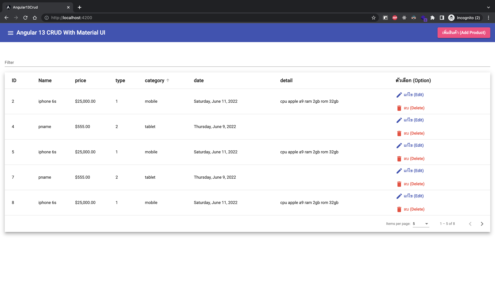
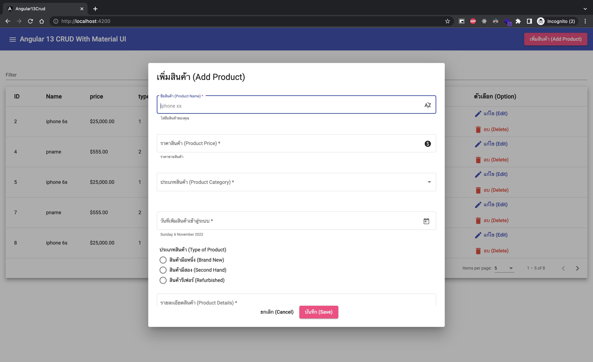
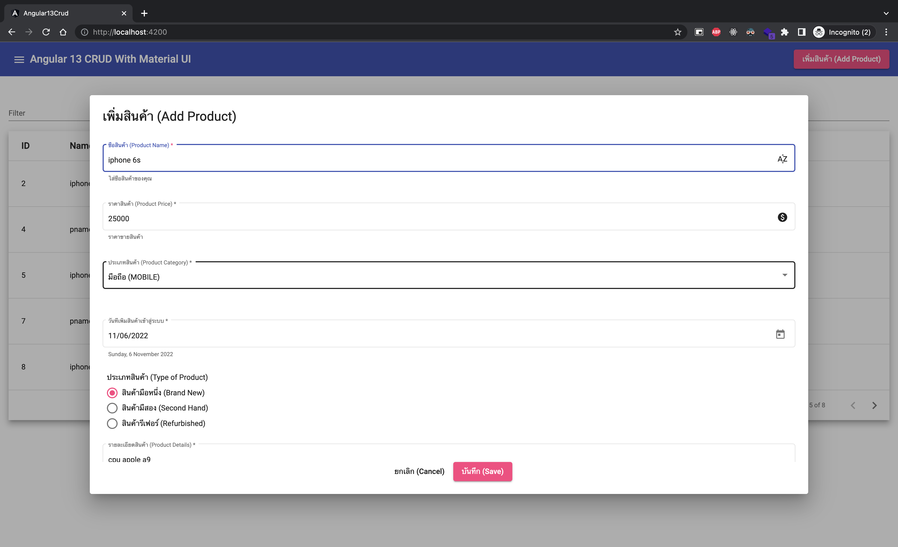
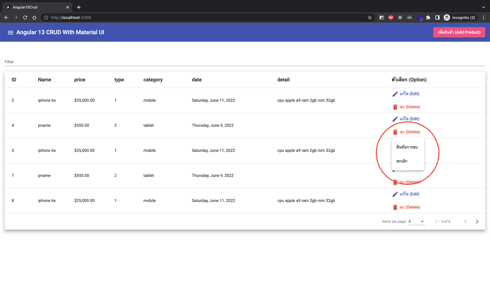
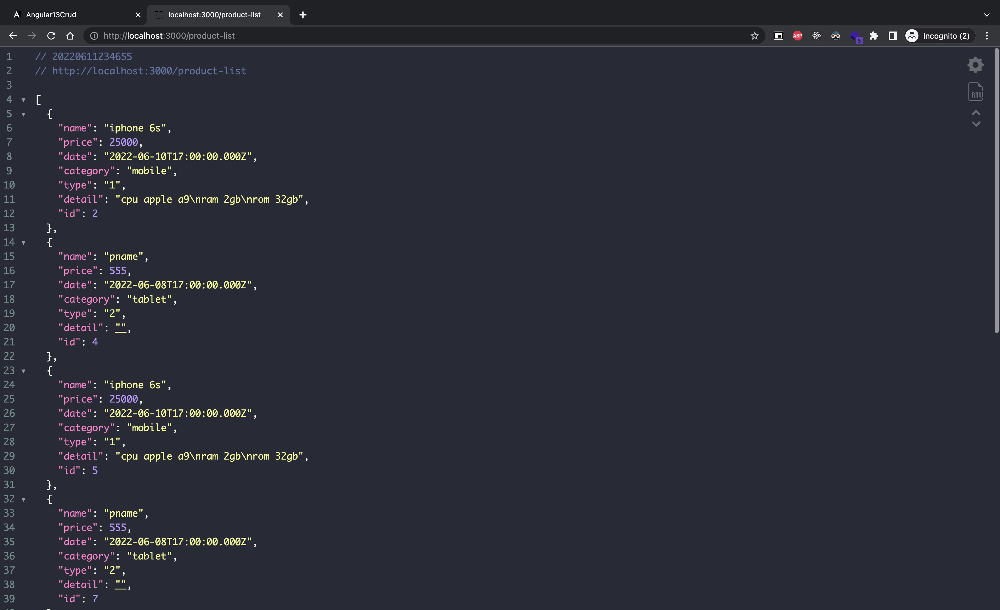

# Angular 13 CRUD Tutorial

This project was generated with [Angular CLI](https://github.com/angular/angular-cli) version 13.1.4.

# Installation

1. ติดตั้ง node module ด้วยคำสั่ง

> `npm i`

2. เปิด json-server สำหรับเป็น demo service data (ข้อมูลอยู่ในไฟล์ db.json) ซึ่ง service จะอยู่ที่ <http://localhost:3000>

> `json-server --watch db.json`

3. สั่งให้ angular ทำงานด้วยคำสั่ง

> `ng s -o`

# Previews

1. _หน้าแรก (homepage)_
   

1. _ป๊อบอัพเพิ่มสินค้า (add product dialog)_
   

1. _ป๊อบแก้ไขเสินค้าจากข้อมูลเดิม (edit product dialog)_
   

1. _เมนูยืนยันลบสินค้า (menu confirm delete product)_
   

1. _ตัวอย่างข้อมูล db.json (example json demo database)_
   

## Development server

Run `ng serve` for a dev server. Navigate to `http://localhost:4200/`. The app will automatically reload if you change any of the source files.

## Code scaffolding

Run `ng generate component component-name` to generate a new component. You can also use `ng generate directive|pipe|service|class|guard|interface|enum|module`.

## Build

Run `ng build` to build the project. The build artifacts will be stored in the `dist/` directory.

## Running unit tests

Run `ng test` to execute the unit tests via [Karma](https://karma-runner.github.io).

## Running end-to-end tests

Run `ng e2e` to execute the end-to-end tests via a platform of your choice. To use this command, you need to first add a package that implements end-to-end testing capabilities.

## Further help

To get more help on the Angular CLI use `ng help` or go check out the [Angular CLI Overview and Command Reference](https://angular.io/cli) page.
